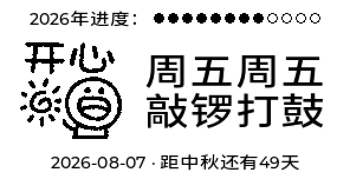

# quote0-worker-weekly — 打工人周历

每天清晨往 MindReset Dot Quote/0 电子墨水屏（296×152 黑白）推一张"打工人精神状态"卡片：



三段式：顶部 12 个月进度圆点（实心=已过含当前月）→ 中部表情包 + 两行大字 → 底部日期与下一个法定假期倒计时。假期表在 `worker_reminder/holidays.py`，按国务院安排每年维护。

## 文案

前半句固定为"周X周X"（当天周几），后半句从**当天文案池**随机抽一句（以当天日期+周几为种子，同一天内结果稳定）：

| 周几 | 前半句（固定） | 后半句池 |
|---|---|---|
| 周一 | 周一周一 | 奄奄一息 / 惨惨戚戚 / 呆若木鸡 |
| 周二 | 周二周二 | 命剩一半 / 苦忧参半 / 魂散一半 |
| 周三 | 周三周三 | 三座大山 / 续命上班 / 心情一般 / 两眼一翻 |
| 周四 | 周四周四 | 重见天日 / 差点逝世 / 逐渐放肆 |
| 周五 | 周五周五 | 眉飞色舞 / 敲锣打鼓 / 生龙活虎 |
| 周六 | 周六周六 | 假装很秀 |
| 周日 | 周日周日 | 死期将至 / 悲伤度日 |

## 双 API 模式

| | Image API（默认） | Canvas API |
|---|---|---|
| payload | 整卡 296×152 PNG（本地 Pillow 渲染烤字） | windowData DSL（文字设备端渲染 chillksans） |
| 端点 | POST `/api/authV2/open/device/{id}/image` | POST `/api/authV2/open/device/{id}/canvas` |
| 前提 | Content Studio 的 Loop 任务添加 **Image API** 内容项 | Loop 任务添加 **Canvas API** 内容项 |

**在 Dot. App → Content Studio → 设备的 Loop 任务中，分别添加 "Canvas API" 与 "Image API" 内容**（用哪个 API 就添加哪个）。切换方式：`.env` 的 `PUSH_MODE` 或命令行 `--api`。

## 快速开始

```bash
# 1. 安装 uv（本项目用 uv 管理 Python 环境）
curl -LsSf https://astral.sh/uv/install.sh | sh

# 2. 初始化环境（Python 3.12 + Pillow）
uv sync

# 3. 配置密钥（从 Dot. App 获取）
cp .env.example .env   # 填入 DOT_API_KEY / DOT_DEVICE_ID；运行时会自动读取，无需手动 export

# 4. 渲染设计样式预览图（输出 preview/，--scale 4 可放大查看）
uv run python tools/render_preview.py

# 5. 推送（默认推当天 + Image API 整卡）
uv run python -m worker_reminder.main
```

## 用法

```bash
uv run python -m worker_reminder.main                # 推当天卡片（Image API，默认）
uv run python -m worker_reminder.main --api canvas   # Canvas API DSL
uv run python -m worker_reminder.main --day 周一     # 指定周几（调试用）
uv run python -m worker_reminder.main --treatment fs # 表情包抖动处理（默认 bw 硬阈值）
uv run python -m worker_reminder.main --meme-mode fixed  # 表情包固定单日文件（默认分组随机）
uv run python -m worker_reminder.main --dry-run      # 只打印 payload 不推送
uv run python -m worker_reminder.main --preview      # 渲染预览图
```

## 定时任务（cron）

已安装到用户 crontab（系统时区 UTC）：

```
5 23 * * * <项目路径>/run_worker_reminder.sh
```

= 每天 **7:05 北京时间**推送（wrapper 内 `export TZ='Asia/Shanghai'`，周几取北京时间；代码内也统一用 `Asia/Shanghai` 取日期，直接运行不会受系统时区影响）。日志按日轮转在 `logs/worker_<日期>.log`，另有 `flock` 防止手动与定时任务重叠重复推送。

## 目录结构

```
├── pyproject.toml            # uv 项目（Pillow 依赖）
├── run_worker_reminder.sh   # cron 入口 wrapper
├── worker_reminder/
│   ├── slogans.py            # 文案表（A/B 变体）
│   ├── image_utils.py        # 表情包管线：GIF→黑白二值 PNG
│   ├── render_card.py        # 整卡 296×152 渲染（Image 模式+预览共用）
│   ├── layout.py             # Canvas DSL payload
│   ├── dot_push.py           # 推送客户端（canvas + image）
│   ├── config.py             # .env 配置
│   └── main.py               # CLI
├── tools/render_preview.py   # 设计样式预览
├── pic/                      # 表情包素材（周一周二/周三/周四/周五周六周日 分组文件夹 + 顶层单日文件）
├── fonts/ChillKSans.otf      # Chill K Sans 字体（本地渲染用）
└── preview/                  # 预览图输出
```

## 说明

- **字体**：设备端 Canvas 模式用设备自带 Chill K Sans（`text-28-chillksans`）；Image 模式本地用 `fonts/ChillKSans.otf`（OFL 开源免费商用）烤字。
- **表情包**：取图两模式 —— `random`（默认）按周几从 `pic/周一周二|周三|周四|周五周六周日/` 分组文件夹随机抽一张（同一天内结果稳定），文件夹缺失/为空时回退顶层单日文件；`fixed` 固定用 `pic/周一.GIF` 这类单日文件。素材为 240×240 透明背景贴纸，本地二值化（默认硬阈值，可选 Floyd-Steinberg）后以严格 0/255 输出，设备端 `img-dither-none` 原样显示。切换方式：`.env` 的 `MEME_MODE` 或命令行 `--meme-mode`。
- **设备离线**：API 会把内容排队，设备下次唤醒时显示，属正常行为。
- **素材声明**：`pic/` 下表情包来自微信表情包 **邓邓小夫**，仅供个人学习使用，版权归原作者所有；如需公开分发请自行替换为自有/开源素材。`fonts/ChillKSans.otf` 为 Chill K Sans（[OFL 1.1 开源免费商用](https://www.npmjs.com/package/@fontpkg/chill-k-sans)）。
- 参考项目 `quote0-deepseek-balance` 的 cron（23:55/1:55/3:55/5:55/8:25/15:55 UTC）与本任务不冲突。
